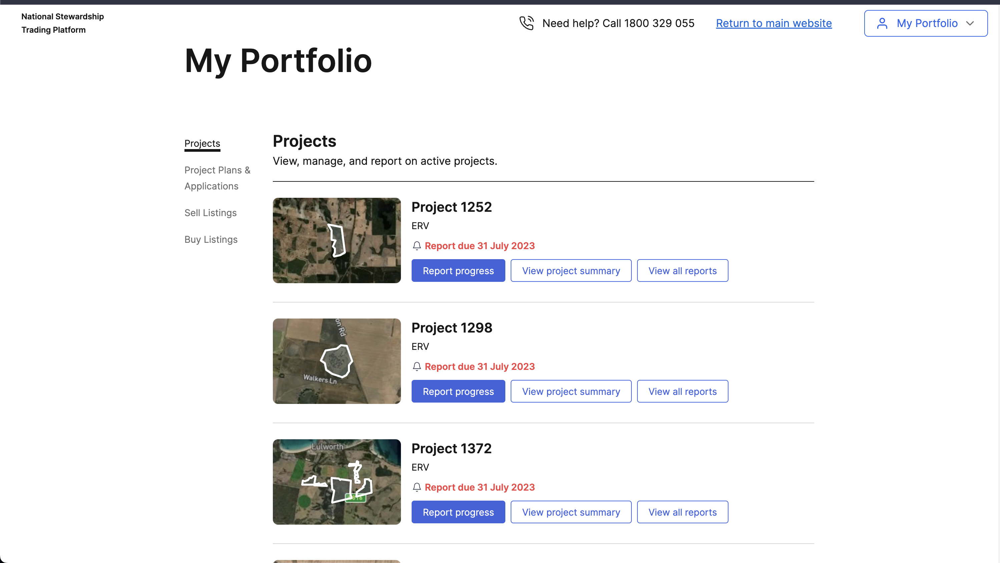
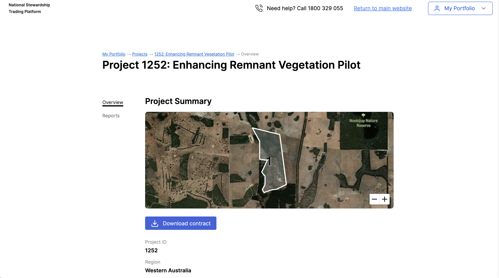

# React coding challenge to hire a Front-end Software Engineer (Next.js and React)

## Introduction

This is a coding challenge to hire a Front-end Software Engineer (Next.js and React) for [AgSteward project](https://agsteward.com.au/).

## The challenge

The challenge is to build a simple web application that displays a list of farms and their details. The application should be built using [Next.js](https://nextjs.org/) and [React](https://reactjs.org/).

### Requirements

- The application should be built using Next.js and React.
- The application should be responsive.

### Bonus points
- The application should be deployed to [Vercel](https://vercel.com/).
- For using [Tailwind CSS](https://tailwindcss.com/).
- For using [TypeScript](https://www.typescriptlang.org/).
- For using Redux or any other state management library.
- For using [Jest](https://jestjs.io/) or any other testing library.

### Data

Please use the following api to get the data for the application.

```
https://s4lajcdqnnp3yx3xwnk4nstbtm0zcekl.lambda-url.us-east-1.on.aws
```

Data structure is like this:

```
[
  {
    "id": 1,
    "name": "Farm 1",
    "address": "Address 1",
    "phone": "Phone 1",
    "email": "Email 1",
    "website": "Website 1",
    "latitude": -33.8688,
    "longitude": 151.2093,
    "managementAreasGeoJSON": "[{\"type\":\"Feature\",\"properties\":{\"projID\":\"1182\",\"P_Area\":\"Planting Area 1\",\"Area_ha\":1.79558500700593},\"geometry\":{\"type\":\"Polygon\",\"coordinates\":[[[147.51464523757747,-41.82394941055073],[147.51423754172447,-41.8239174301686],[147.51434482974423,-41.821390926972946],[147.5153962558114,-41.820831244974734],[147.51464523757747,-41.82394941055073]]]}},{\"type\":\"Feature\",\"properties\":{\"projID\":\"1182\",\"P_Area\":\"Planting Area 2\",\"Area_ha\":0.753104444593191},\"geometry\":{\"type\":\"Polygon\",\"coordinates\":[[[147.54822947542587,-41.81763059468868],[147.54889466331122,-41.817030900041516],[147.54978515684732,-41.816799016555315],[147.55032159875014,-41.81677502852547],[147.550740023383,-41.81638322342603],[147.55156614394895,-41.81654314408549],[147.5498548943313,-41.817062883818956],[147.54822947542587,-41.81763059468868]]]}},{\"type\":\"Feature\",\"properties\":{\"projID\":\"1182\",\"P_Area\":\"Planting Area 3\",\"Area_ha\":1.926778692612052},\"geometry\":{\"type\":\"Polygon\",\"coordinates\":[[[147.54434266059357,-41.81627365071558],[147.5447074411399,-41.8165934922846],[147.53707923712966,-41.816177698498386],[147.5373796445633,-41.81592182366327],[147.54434266059357,-41.81627365071558]]]}},{\"type\":\"Feature\",\"properties\":{\"projID\":\"1182\",\"P_Area\":\"Planting Area 4\",\"Area_ha\":1.185119518771768},\"geometry\":{\"type\":\"Polygon\",\"coordinates\":[[[147.54178919629763,-41.81053222257542],[147.54213251914442,-41.810700154639],[147.54105963543427,-41.8114998253045],[147.5404373628747,-41.81185167724724],[147.53970780192373,-41.81220352726519],[147.53823795115923,-41.81268331966691],[147.53813066274313,-41.812419434363306],[147.5396434288516,-41.81192364677676],[147.54082360096962,-41.8112999086138],[147.54178919629763,-41.81053222257542]]]}},{\"type\":\"Feature\",\"properties\":{\"projID\":\"1182\",\"P_Area\":\"Planting Area 5\",\"Area_ha\":3.100076848495007},\"geometry\":{\"type\":\"Polygon\",\"coordinates\":[[[147.5532690533663,-41.81206758439248],[147.5523249161763,-41.81604976001625],[147.5504151829832,-41.816081744510754],[147.55069413272406,-41.81576190033505],[147.55170264351085,-41.815697931233224],[147.55180993185513,-41.81547403914307],[147.5519172200932,-41.8144345299323],[147.55200305072827,-41.813906772642795],[147.5521317966732,-41.81315511081338],[147.5523249157134,-41.81277128008346],[147.55288281518412,-41.81198761852338],[147.5532690533663,-41.81206758439248]]]}}]"
  },
  ...
]
```

### Design

You can suggest any design that fits this simple application so please feel free to use your creativity. 

having said that here is couple of screenshots from AgSteward website that you can use as a reference.

The data structure offered to you is not the same as the data structure used in the screenshots below so please use the data structure offered to you.





### Submission

You can submit your solution by sending a link to your repository.

### Questions

Please communicate with us via email to clarify any questions you may have.
